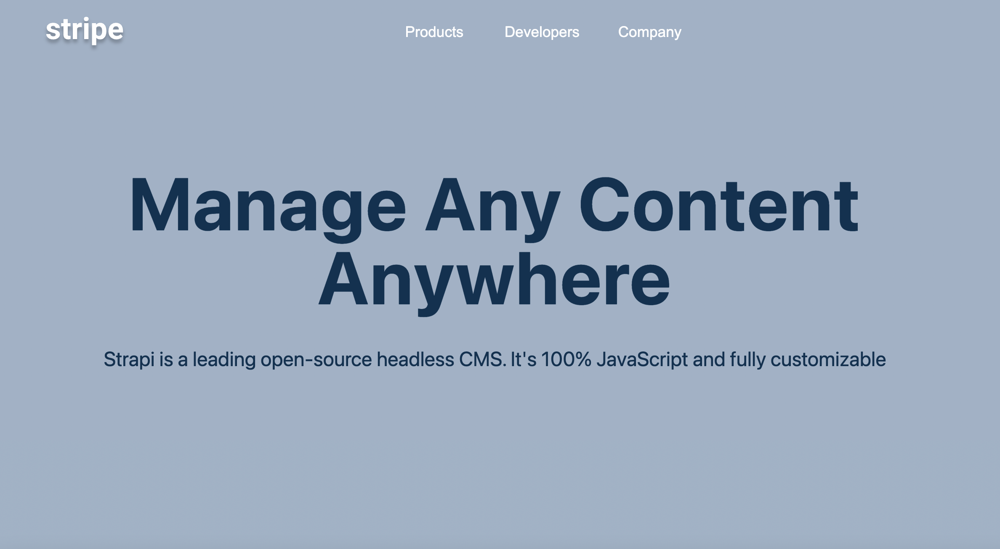
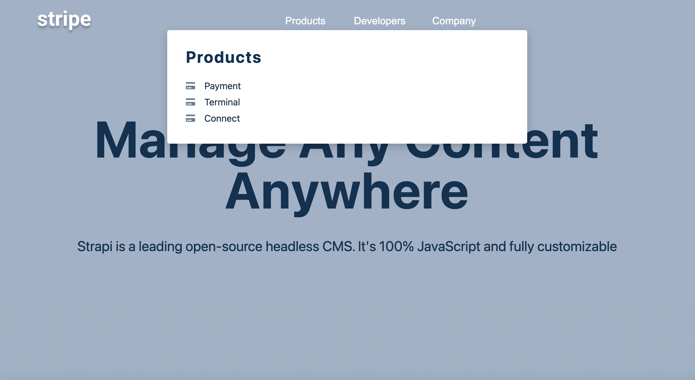
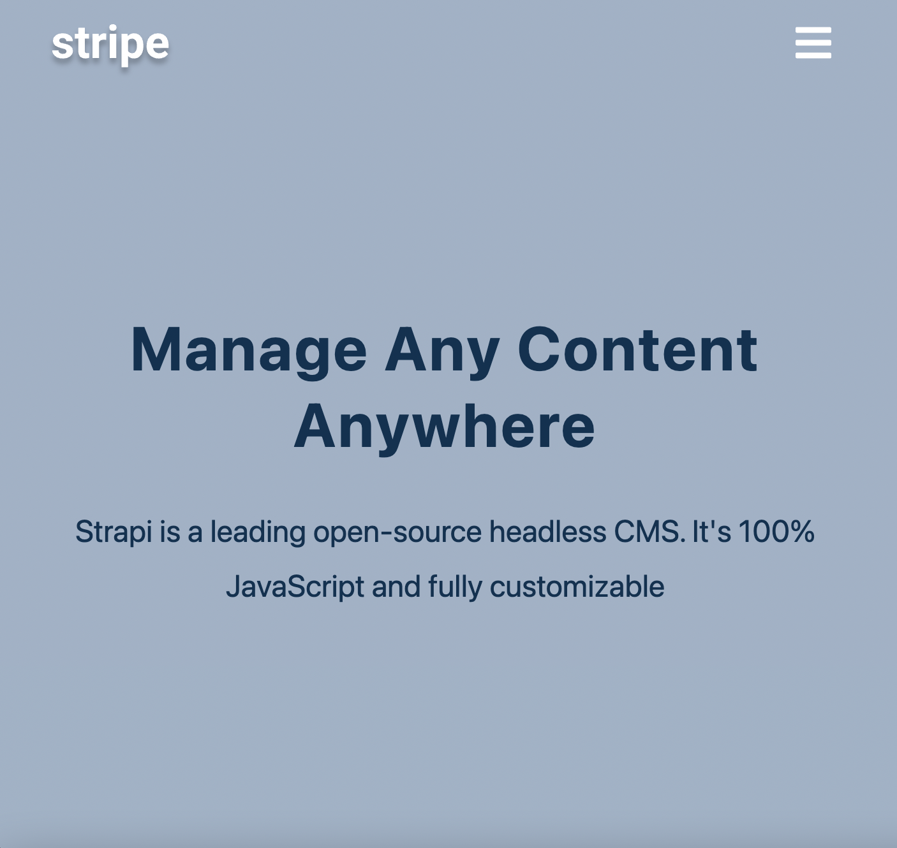
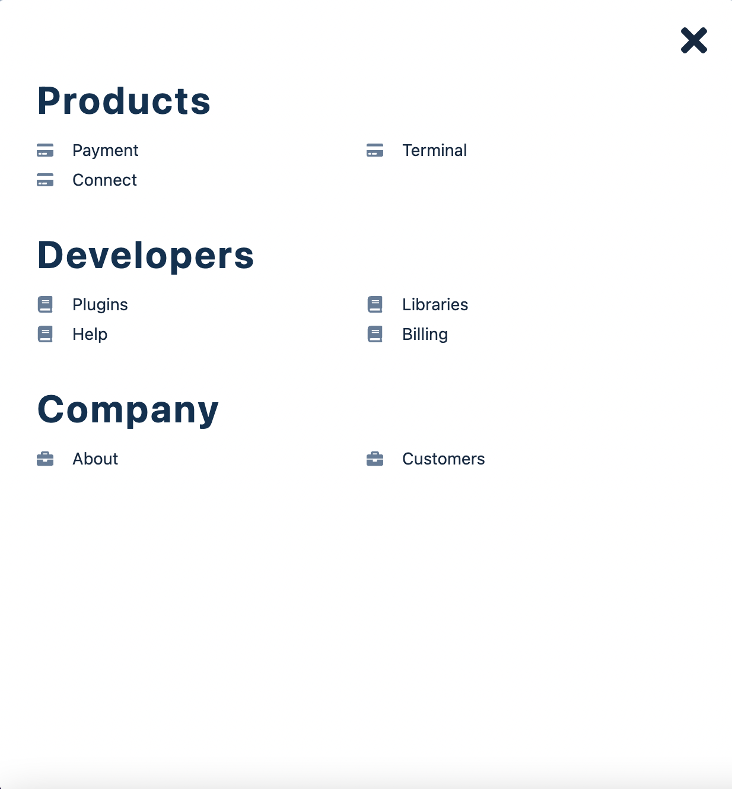

## Sidebar Web

### Description

- A web of two sidebar
- The topics and sub-topics are displayed in the sidebar

#### In the big screen

- The sidebar for each topic can be showed by moving mouse to the topic
- The sidebar for each topic can be closed by moving mouse out of the topic or sidebar
- The topics and sub-topics are displayed in the sidebar

#### In the small screen

- The sidebar can be opened by clicking the bar button on the top left
- The sidebar can be closed by clicking the cross buttons on the top right of the sidebar

### The captures of the web

#### Big screen

#### Big screen with sidebar opened

#### Small screen

#### Small screen with sidebar opened

